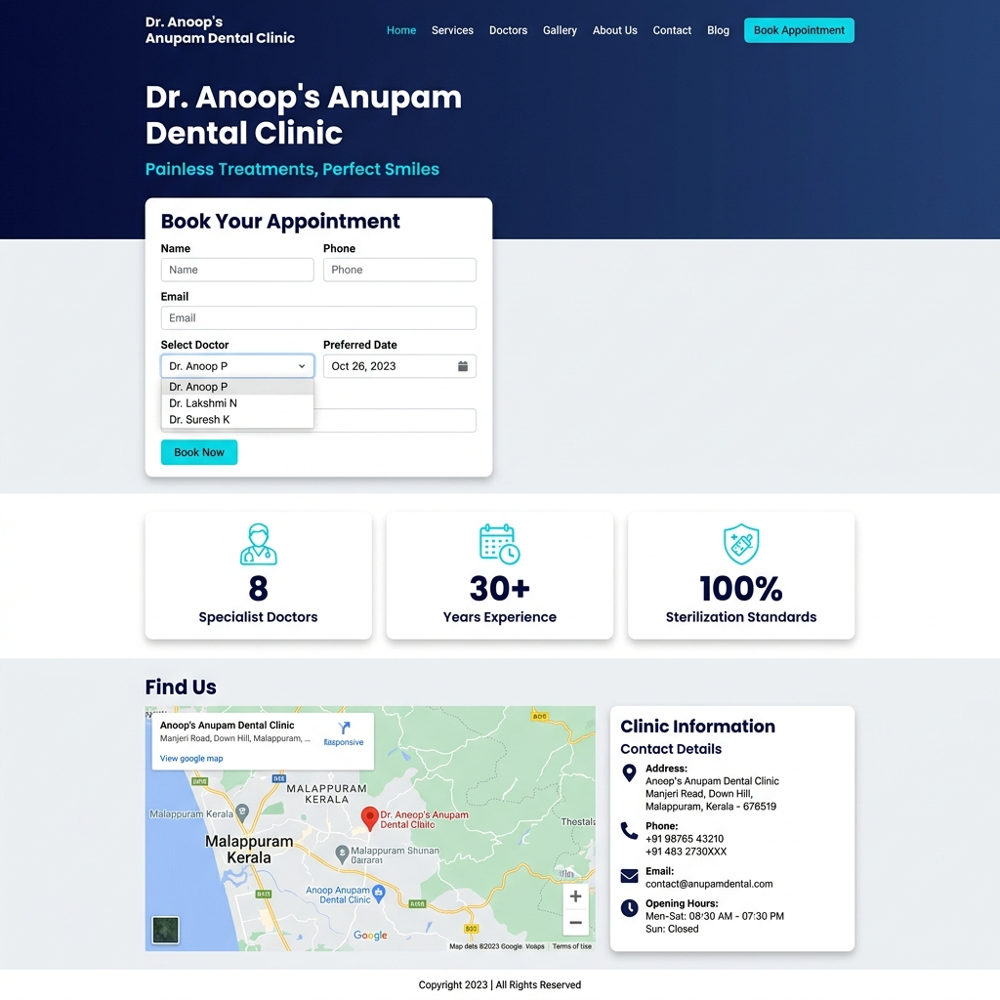
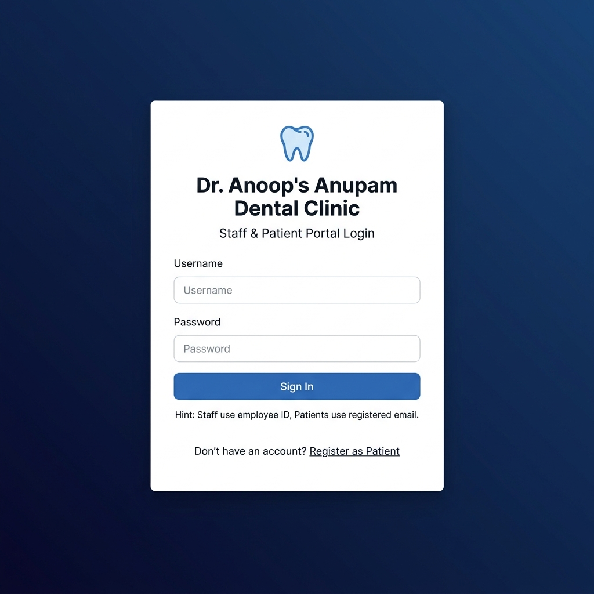
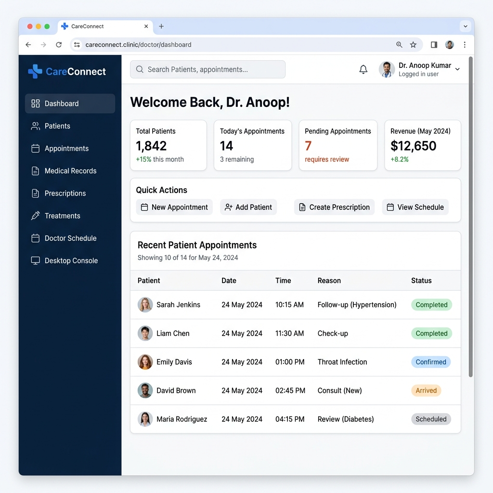
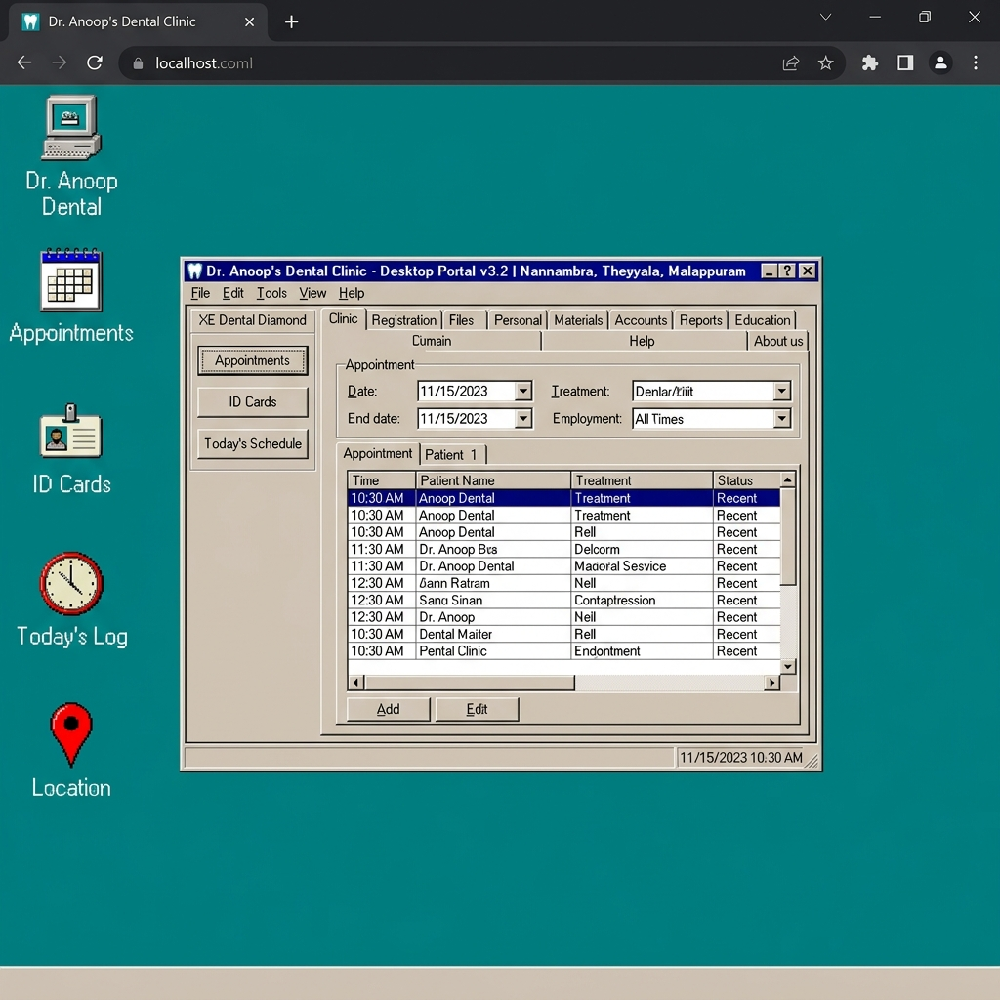
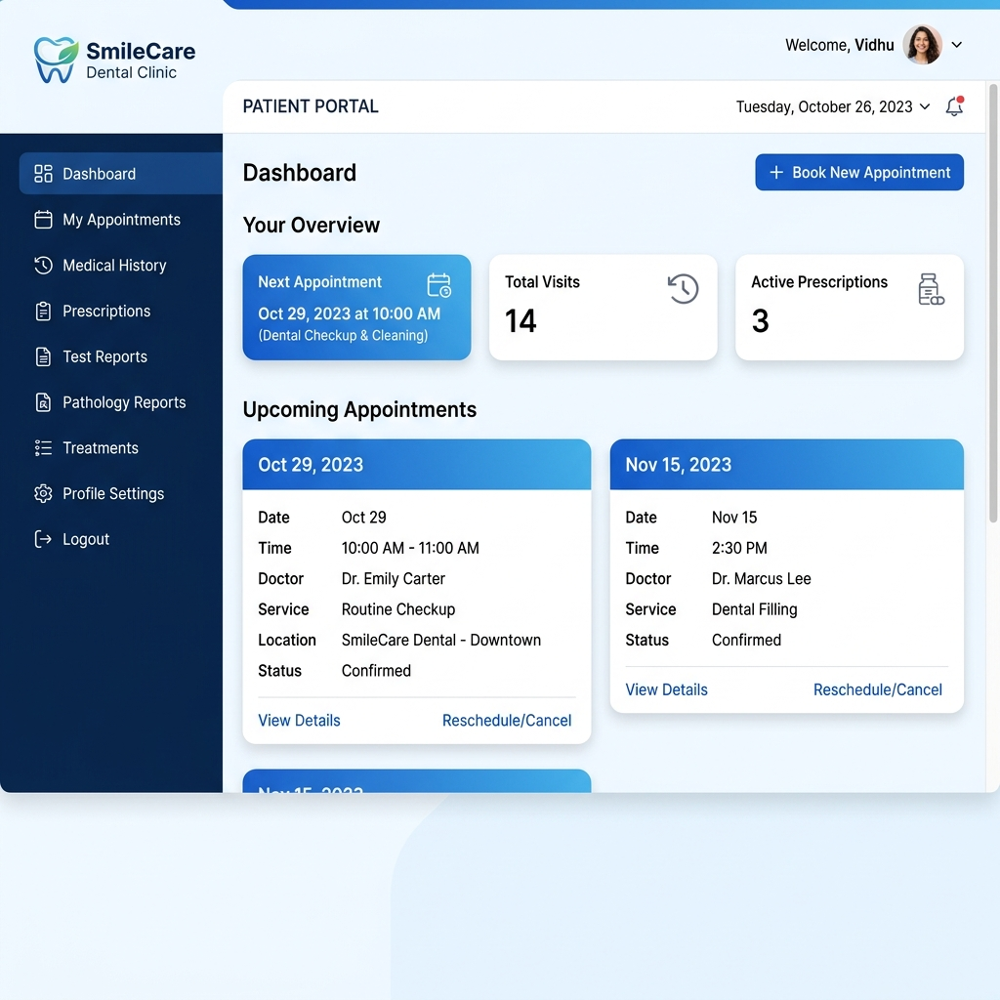
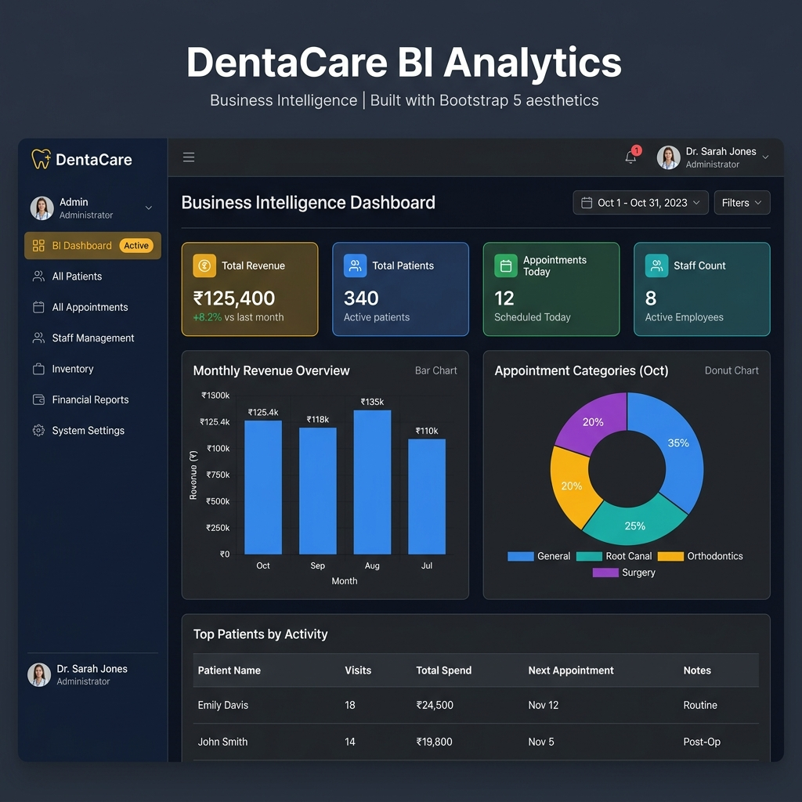

# 🦷 Dr. Anoop's Anupam Dental Clinic — Web Portal & Management System

<div align="center">



### A full-stack Django-powered dental clinic management platform with Patient Portal, Doctor Dashboard, AI Features, Google Maps Integration, and a retro-style Clinical Desktop Console.

[](https://www.djangoproject.com/)
[](https://www.python.org/)
[](https://getbootstrap.com/)
[](https://www.sqlite.org/)
[](LICENSE)

</div>

---

## 📋 Table of Contents

- [Overview](#-overview)
- [Screenshots](#-screenshots)
- [Features](#-features)
- [Tech Stack](#-tech-stack)
- [Installation](#-installation)
- [Demo Credentials](#-demo-credentials)
- [Project Structure](#-project-structure)
- [System Modules](#-system-modules)

---

## 🏥 Overview

**Dr. Anoop's Anupam Dental Clinic** is a comprehensive dental clinic web portal built with Django. It provides a unified platform for managing patients, appointments, medical records, inventory, billing, and business intelligence — all in one place.

The system features three role-based portals:
- 🩺 **Doctor Portal** — Full clinical management with XE Dental Diamond Desktop Console
- 👤 **Patient Portal** — Personal health records, appointment booking, prescriptions
- ⚙️ **Admin Portal** — Business intelligence, staff management, system settings

**Clinic Location:** Nannambra, Theyyala, Malappuram, Kerala - 676320  
📞 +91 9446046868 | 📧 anoopkranupam@gmail.com  
🗺️ [View on Google Maps](https://share.google/ivyVbbao9TSrVqW8R)

---

## 📸 Screenshots

### 🌐 Public Website — Home Page
> Landing page with AI diagnostics sandbox, services overview, specialist team directory, and Google Maps integration.


---

### 🔐 Login Page
> Unified role-based login for Doctors, Patients, and Admin staff.



---

### 🩺 Doctor Dashboard
> Comprehensive clinical ERP with patient management, appointments, medical records, prescriptions, treatments, and scheduling.



---

### 💻 Dr. Anoop's Dental Clinic — Desktop Portal (XE Dental Diamond Console)
> A fully functional retro Windows 98-style clinical management desktop portal, accessible from the Doctor Dashboard. Features drag-and-drop windows, multi-tab workspace with Clinic information, patient registration, files, materials inventory, accounts, reports, education, and a live Google Maps location embed.



---

### 👤 Patient Portal
> Patients can view appointments, medical history, prescriptions, test reports, pathology results, and treatment records.



---

### 📊 Admin Business Intelligence Dashboard
> Real-time analytics with financial charts, patient statistics, appointment trends, staff management, and inventory oversight.



---

## ✨ Features

### 👥 Patient Management
- ✅ New patient registration with auto-generated Patient ID
- ✅ Family member linking
- ✅ Complete Electronic Dental Records (EDR)
- ✅ Dental charting, progress notes, prescriptions
- ✅ Medical history & allergy tracking
- ✅ Emergency contact management

### 📅 Appointment System
- ✅ Book, confirm, cancel appointments
- ✅ Doctor-specific scheduling
- ✅ Today's schedule view
- ✅ Appointment reminders dispatch (SMS/WhatsApp simulation)
- ✅ Missed appointment tracking

### 🩺 Clinical Features
- ✅ Diagnostic reports & clinical images
- ✅ Prescriptions with drug dosage
- ✅ Treatment plans & history
- ✅ Lab test orders & results
- ✅ Pathology report management

### 💊 Inventory Management
- ✅ Medicines and consumable tracking
- ✅ Reorder alert system (highlighted in red when below threshold)
- ✅ Batch ID and supplier tracking

### 💰 Financial Management
- ✅ Invoice generation
- ✅ Consultation fee tracking
- ✅ Revenue analytics

### 🤖 AI Sandbox Features
- ✅ Interactive AI X-Ray diagnostic analyzer simulation
- ✅ Smile designer comparison tool (before/after veneers/whitening)
- ✅ 24/7 AI Chatbot (Anupam AI Assistant)

### 💻 XE Dental Diamond Desktop Console
- ✅ Full-screen retro Windows 98-style clinical portal
- ✅ Draggable floating sub-windows
- ✅ Patient registration directly from console
- ✅ Live Google Maps location embed (Clinic tab)
- ✅ Appointment scheduler with date range filter
- ✅ Patient ID card generator with barcode
- ✅ Materials/inventory ledger
- ✅ Financial reports & BI charts
- ✅ Desktop icon shortcuts
- ✅ Themed: Classic Teal, Windows Slate Blue, Midnight Blue

### 📍 Location & Maps
- ✅ Google Maps embed on home page
- ✅ Google Maps embed in console (Clinic tab)
- ✅ Mini maps in website footer
- ✅ Clickable address → [Google Maps Share Link](https://share.google/ivyVbbao9TSrVqW8R)

### 👨‍⚕️ Staff Management
- ✅ Doctor profiles with specialization, license, schedule
- ✅ Role-based access control (Admin / Doctor / Patient)
- ✅ Staff scheduling & working hours

---

## 🛠️ Tech Stack

| Layer | Technology |
|-------|-----------|
| Backend | Django 4.x (Python) |
| Frontend | Bootstrap 5.3, Vanilla JS, Custom CSS |
| Database | SQLite (development) |
| Icons | Bootstrap Icons 1.11 |
| Fonts | Google Fonts (Inter, Plus Jakarta Sans) |
| Maps | Google Maps Embed API |
| Charts | CSS bar charts + Business Intelligence views |
| Auth | Django built-in auth + custom role system |

---

## ⚡ Installation

### Prerequisites
- Python 3.10+
- pip
- Git

### Quick Setup

```bash
# 1. Clone the repository
git clone https://github.com/kakkarot23/DENTAL_CLINICS_WEBPORTAL_-_MANAGEMENT_SYSTEM.git
cd DENTAL_CLINICS_WEBPORTAL_-_MANAGEMENT_SYSTEM

# 2. Create and activate virtual environment
python -m venv venv

# Windows
venv\Scripts\activate

# macOS/Linux
source venv/bin/activate

# 3. Install dependencies
pip install -r requirements.txt

# 4. Run migrations
python manage.py migrate

# 5. Create superuser (optional)
python manage.py createsuperuser

# 6. Populate sample data (optional)
python populate_data.py
python populate_official_doctors.py

# 7. Start the development server
python manage.py runserver
```

Visit: **http://127.0.0.1:8000/**

---

## 🔑 Demo Credentials

| Role | Username | Password | Portal URL |
|------|----------|----------|------------|
| 🩺 Doctor (Admin) | `Anoop` | `Anoop123` | `/doctor/dashboard/` |
| 👤 Patient | `vidhu` | `Vidhu123` | `/patient/dashboard/` |

> **Note:** The Doctor account for `Anoop` has full admin privileges, including access to the XE Dental Diamond Desktop Console at `/doctor/desktop/`

---

## 📁 Project Structure

```
dental_clinic/
├── clinic/
│   ├── models.py          # Patient, Doctor, Appointment, Prescription, etc.
│   ├── views.py           # All view controllers
│   ├── urls.py            # URL routing
│   ├── admin.py           # Django admin config
│   ├── templates/
│   │   └── clinic/
│   │       ├── base.html                  # Base layout with navbar & footer
│   │       ├── home.html                  # Public landing page
│   │       ├── login.html                 # Login page
│   │       ├── doctor_dashboard.html      # Doctor ERP panel
│   │       ├── doctor_desktop_console.html # XE Dental Diamond Console
│   │       ├── patient_dashboard.html     # Patient portal
│   │       ├── admin_dashboard.html       # Admin BI dashboard
│   │       ├── patent_list.html           # Patient list
│   │       ├── patent_detail.html         # Patient detail
│   │       ├── patent_form.html           # Patient registration/edit
│   │       ├── doctor_appointments.html   # Appointment management
│   │       └── ...                        # 20+ more templates
│   └── static/
│       ├── css/styles.css                 # Custom CSS design system
│       └── images/                        # Clinic images & assets
├── dental_clinic/
│   ├── settings.py
│   ├── urls.py
│   └── wsgi.py
├── screenshots/           # Page screenshots for README
├── requirements.txt
├── manage.py
├── populate_data.py
├── populate_official_doctors.py
├── setup.bat              # Windows quick setup script
├── setup.sh               # Linux/Mac quick setup script
└── .env.example           # Environment variables template
```

---

## 📦 System Modules

### 1. Patient Management
- **Registration**: `/patient/register/` — New patient registration
- **Patient List**: `/patients/` — Browse all patients
- **Patient Detail**: `/patients/<id>/` — Full patient profile

### 2. Appointment System
- **Book**: `/appointments/book/` — New booking
- **Doctor View**: `/doctor/appointments/` — Manage appointments
- **Patient View**: `/patient/appointments/` — Personal schedule

### 3. Medical Records
- **Medical History**: `/patient/medical-history/`
- **Test Reports**: `/patient/test-reports/`
- **Pathology Reports**: `/patient/pathology-reports/`
- **Prescriptions**: `/patient/prescriptions/`
- **Treatments**: `/patient/treatments/`

### 4. Admin Portal
- **Admin Dashboard**: `/admin-dashboard/` — BI & statistics

### 5. Doctor Portal
- **Doctor Dashboard**: `/doctor/dashboard/` — Main ERP panel
- **Desktop Console**: `/doctor/desktop/` — XE Dental Diamond OS Portal

---

## 👨‍⚕️ Clinical Team

| Doctor | Specialization | Reg No |
|--------|---------------|--------|
| Dr. Anoopkumar R | BDS — Chief Surgeon & Founder | 1732 |
| Dr. Terry Thomas | MDS — Orthodontist | 45678 |
| Dr. KrishnaKumar | MDS — Pedodontist (Child Specialist) | 18923 |
| Dr. Renjith Raj | MDS — Endodontist (RCT Specialist) | 22345 |
| Dr. Justin Mathew | MDS — Oral & Maxillofacial Surgeon | 31256 |
| Dr. Joseph J Pulikkottil | MDS — Periodontist | 09876 |
| Dr. Sijo P Mathew | MDS — Endodontist | 54321 |
| Dr. Shibu Sreedhar | MDS — Smile Designer | 1561-A |

---

## 📍 Clinic Location

**Dr. Anoop's Anupam Dental Clinic**  
Nannambra, Theyyala, Malappuram, Kerala — 676320  
📞 +91 9446046868  
📧 anoopkranupam@gmail.com  

🗺️ [**Open in Google Maps →**](https://share.google/ivyVbbao9TSrVqW8R)

---

## 📄 License

This project is licensed under the MIT License.

---

<div align="center">
Made with ❤️ for Dr. Anoop's Anupam Dental Clinic, Malappuram, Kerala
</div>
